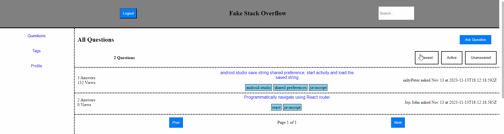
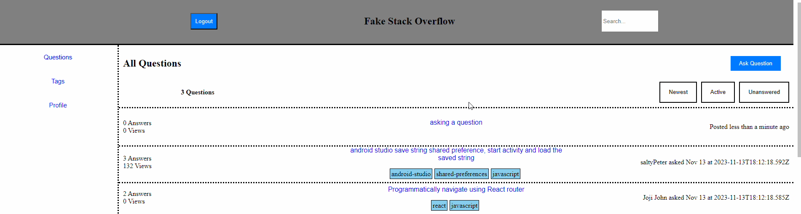
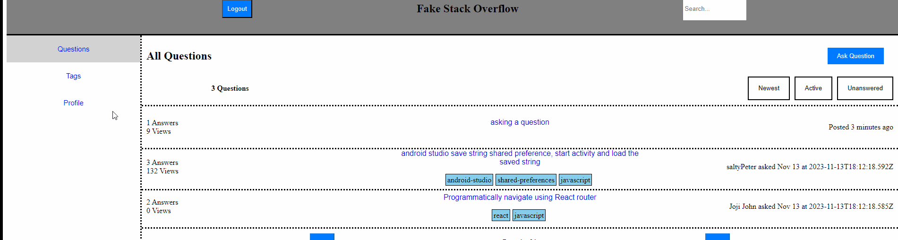

## Instructions to setup and run project

Introduction 
Welcome to the FakeStackOverflow! This application provides a platform for users to engage in discussions in a Q&A format. Registered users can ask questions, provide answers, upvote/downvote, comment, and browse various tags associated with questions. Users have reputation that can unlock and lock certain features. We intend to create a friendly community forum for all technical questions.

## Features:

Authentication
In order to interact with the FakeStackOverflow, users need to sign up and log in. Authentication makes sure that asking questions, answering questions, commenting, and voting are recorded correctly in the database. There is an option to continue as a guest user which has view-only functionality and the user would have to log in, in order to interact with the site.

### Ask Questions
Users can ask questions on various topics. The question form allows users to provide details, summarize, and submit their inquiries to the community. Eligible users with over 50 reputation will be able to create new tags, and comment.

### Answer Questions
Registered users can contribute by providing answers to posted questions. Answers can be upvoted or downvoted based on their helpfulness. Answers will be shown upon clicking a question and scrolling down.

# Upvoting/Downvoting
Registered users with over 50 reputation will have the ability to upvote or downvote questions, answers, and comments. This feature helps in highlighting the most valuable and least valuable content. Upvoting will increase the user's reputation by 5 points, and downvoting will decrease the reputation of the appropriate user by 10 points.

### Commenting
Registered users with over 50 reputation can leave comments on questions and answers. Comments allow users to ask for additional information, ask a minor question, give a suggestion, etc.

### Tagging
Questions can be tagged with relevant keywords. Tags help in categorizing content and making it easier for users to find topics of interest.

### User Profile
Each user has a profile page that displays their activity on the platform. Users can see the questions they've asked, answers they've provided, and tags associated with their questions

### Search
Efficiently find relevant content using the search feature. Users can search with tags or keywords for various questions.

### How to Use:

Firstly, clone the repository onto your local device.

Please run npm install on both the client and server folders:

  Refer to the package.json folders to see the various modules needed for client and server

Ensure the mongosh service is running locally on the port localhost:27017/fake-so

The client service will run on localhost:3000 and the server will run on localhost:8000

Before running the client and server please initialize the database and admin credentials by doing the following:
  node init.js admin_username admin_password mongodb://27017/fake-so

To start the application:

  Run npm start in the client directory 

  Run node server.js in the server directory
  

